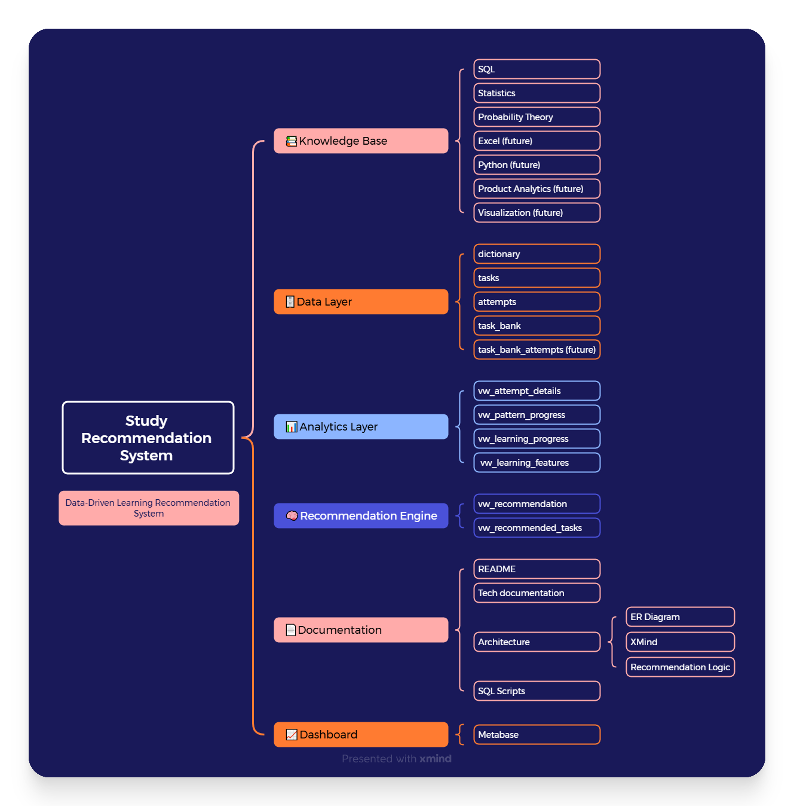
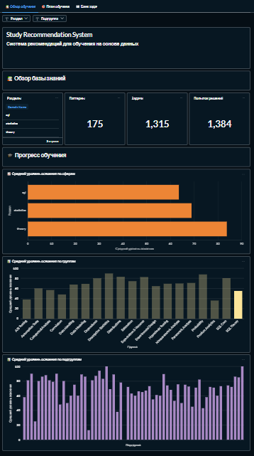
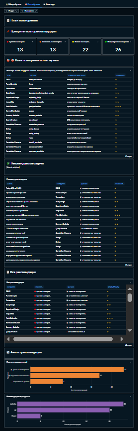
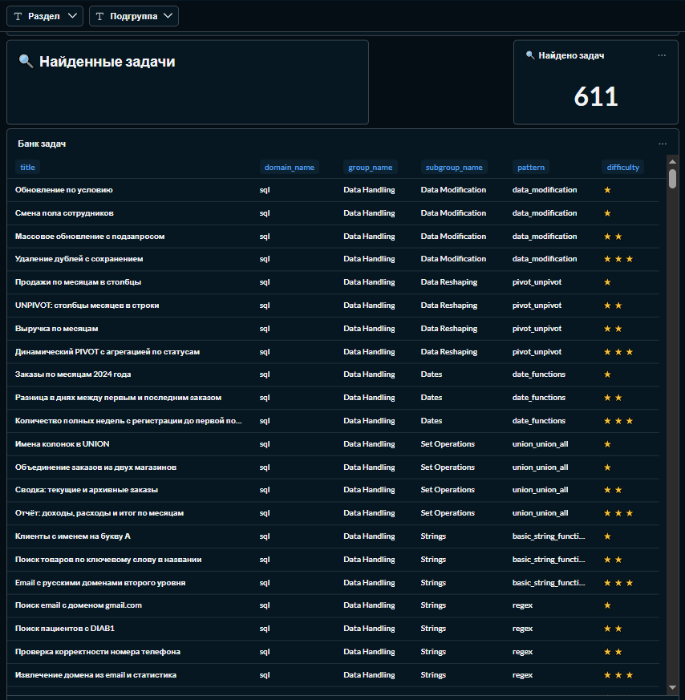

# 📚 Study Recommendation System

**Study Recommendation System** — pet-проект по разработке аналитической системы, которая использует историю обучения для оценки уровня освоения материала и формирования рекомендаций по его повторению.

В отличие от обычного журнала решённых задач система не только хранит историю обучения, но и использует её для оценки уровня знаний и формирования рекомендаций по повторению материала.

## Почему этот проект интересен

Большинство учебных pet-проектов ограничиваются анализом готовых данных или реализацией отдельных SQL-запросов.

Study Recommendation System разрабатывается как единая аналитическая система, объединяющая хранение данных, аналитический слой, Recommendation Engine и Dashboard.

Проект объединяет:

- проектирование предметной области;
- разработку модели данных;
- проектирование базы данных PostgreSQL;
- построение аналитического слоя;
- разработку Recommendation Engine;
- создание Dashboard в Metabase;
- подготовку технической документации.

Каждый компонент проектировался как часть единой архитектуры и может развиваться независимо от остальных.

---

# Идея проекта

Во время подготовки к техническим собеседованиям быстро становится сложно ответить на вопросы:

- Какие темы уже хорошо освоены?
- Какие знания начинают забываться?
- Какие навыки требуют дополнительной практики?
- Какие задачи стоит решить следующими?

История обучения сама по себе содержит большое количество информации, однако без дополнительного анализа она практически не помогает принимать решения о том, какой материал следует повторить в первую очередь.

Цель проекта — превратить историю обучения в источник данных для принятия решений и автоматизировать процесс формирования рекомендаций.

---

# Архитектура проекта

Архитектура проекта построена по модульному принципу и включает несколько взаимосвязанных компонентов.

- **Knowledge Base** — модель знаний и классификация учебного материала;
- **Data Layer** — хранение задач, попыток решения и банка задач;
- **Analytics Layer** — расчёт аналитических показателей;
- **Recommendation Engine** — алгоритм формирования рекомендаций;
- **Dashboard** — визуализация результатов анализа.

📖 **Подробное описание архитектуры, модели данных и архитектурных решений представлено в документе `System_Design.md`.**

---

## Особенности проекта

В отличие от большинства учебных проектов, Study Recommendation System разрабатывается не как набор отдельных компонентов, а как единая аналитическая система.

Все модули проекта взаимосвязаны:

- модель знаний определяет структуру предметной области;
- база данных хранит историю обучения;
- аналитический слой рассчитывает показатели;
- Recommendation Engine формирует рекомендации;
- Dashboard предоставляет интерфейс для анализа результатов.

Именно такая архитектура позволяет постепенно развивать систему без изменения уже реализованных компонентов.

---

# Recommendation Engine

Recommendation Engine анализирует историю попыток решения задач и автоматически:

- оценивает уровень освоения материала;
- рассчитывает риск забывания;
- выявляет слабые темы и паттерны;
- определяет приоритет повторения;
- подбирает задачи подходящей сложности.

В основе Recommendation Engine лежит алгоритм, основанный на системе правил и аналитических показателях.

📖 **Подробное описание алгоритма приведено в документе `Recommendation_Engine.md`.**

---

# Dashboard

Для анализа результатов используется Dashboard, разработанный в Metabase.

Он включает три основных раздела.

## 📊 Обзор обучения

---

## 🎯 План повторения

---

## 📚 Task Bank

Dashboard предоставляет единый интерфейс для анализа процесса обучения, просмотра рекомендаций и работы с банком задач.

📖 **Подробнее о структуре Dashboard можно прочитать в документе `Dashboard.md`.**

---

# Task Bank

Проект содержит собственный банк задач по:

- SQL;
- теории вероятностей;
- математической статистике.

Каждая задача классифицирована по:

- паттерну;
- тематической группе;
- уровню сложности;
- источнику;
- типичным ошибкам.

В текущей версии проекта Task Bank представляет собой независимую библиотеку задач и постепенно интегрируется с Recommendation Engine.

📖 **Структура банка задач подробно описана в документе `Task_Bank.md`.**

---

# Используемые технологии

### Основной стек

- PostgreSQL 
- SQL 
- DBeaver 
- Metabase 
- GitHub 
- Google Sheets

### Планируется

- Python
- Pandas
- Apache Airflow
- Telegram Bot

---

# Документация

Подробная информация о реализации каждого компонента представлена в отдельных документах проекта.

| Документ | Описание |
|----------|----------|
| 📘 System Design | Архитектура проекта и принципы проектирования |
| 🧠 Recommendation Engine | Алгоритм формирования рекомендаций |
| 🗄️ Database Loading | Процесс загрузки данных |
| 📚 Task Bank | Организация банка задач |
| 📊 Dashboard | Аналитический интерфейс |
| 🚀 Project Roadmap | План развития проекта |

---

# Текущее состояние

На данный момент реализованы:

- ✅ структура базы данных PostgreSQL;
- ✅ модель знаний;
- ✅ Recommendation Engine;
- ✅ аналитические SQL-представления;
- ✅ Dashboard в Metabase;
- ✅ собственный Task Bank;
- ✅ полная техническая документация проекта.

---

# Планы развития

В ближайших версиях проекта планируется:

- интервальное повторение (Spaced Repetition);
- история выполнения задач из Task Bank;
- автоматизация ETL с использованием Python;
- инкрементальная загрузка данных;
- Telegram Bot;
- персонализация рекомендаций.

🚀 **Полный план развития представлен в документе `Project_Roadmap.md`**.
