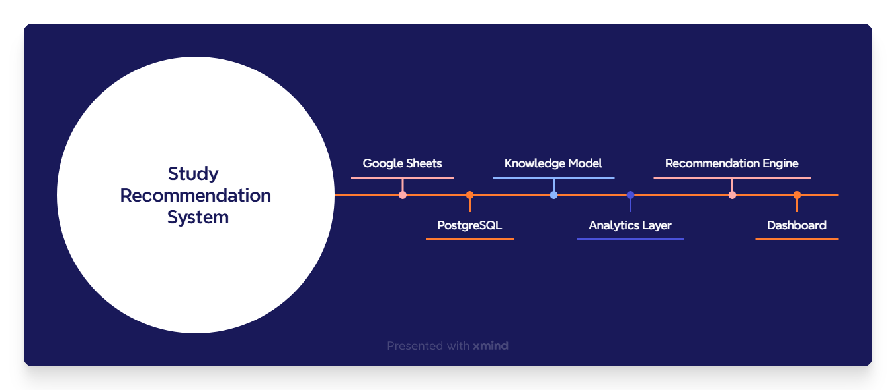
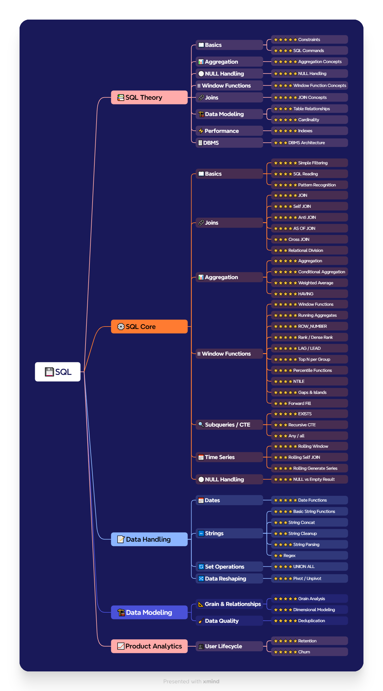
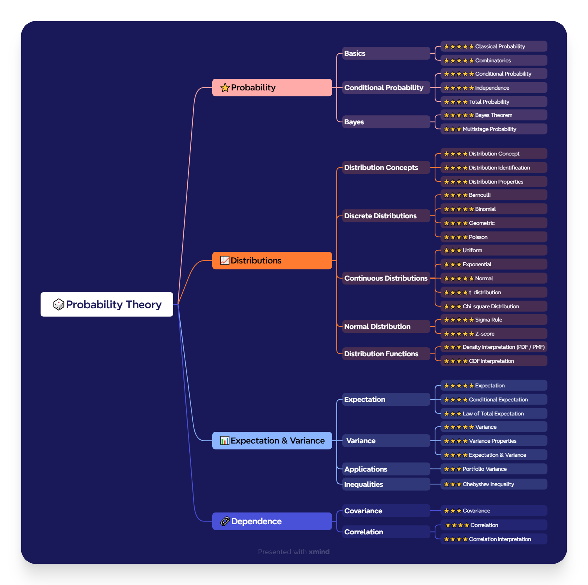
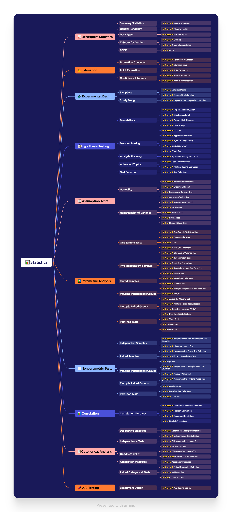
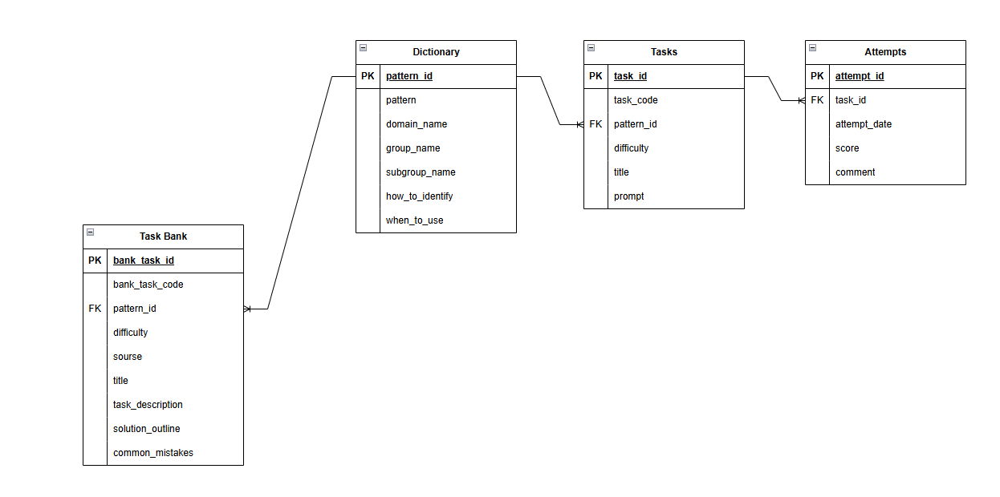

# System Design

## 1. Введение

### Назначение документа

Данный документ описывает архитектуру проекта **Study Recommendation System**, принципы его проектирования и ключевые архитектурные решения.

В документе рассматривается система в целом: модель знаний, модель данных, архитектура компонентов и принципы масштабирования.

Подробная реализация отдельных модулей (**ETL**, **Recommendation Engine**, **Dashboard** и **Task Bank**) вынесена в соответствующие документы.

### Связанные документы

- `README.md` — обзор проекта.
- `Recommendation_Engine.md` — алгоритм формирования рекомендаций.
- `Database_Loading.md` — загрузка данных и ETL.
- `Task_Bank.md` — структура банка задач.
- `Dashboard.md` — описание аналитического интерфейса.
- `Project_Roadmap.md` — направления развития проекта.

---

# 2. История проекта

Проект был разработан как pet-проект в рамках подготовки к позиции **Data Analyst**.

Его целью стало создание системы, которая объединяет проектирование базы данных, образовательную аналитику и алгоритмы формирования персональных рекомендаций для обучения.

В качестве предметной области была выбрана подготовка по **SQL**, **теории вероятностей** и **математической статистике**.

По мере развития проекта стало понятно, что объектом анализа должны быть не отдельные задачи, а знания пользователя. Это привело к появлению модели знаний, аналитического слоя и **Recommendation Engine**.

Развитие проекта происходило постепенно.

### Рисунок 1. Эволюция проекта 



В результате проект превратился из журнала решённых задач в систему поддержки обучения, автоматически формирующую рекомендации на основе накопленной статистики.

Подробное описание этапов развития приведено в документе `Project_Roadmap.md`.

---

# 3. Цели проектирования

При разработке проекта были сформулированы следующие требования.

Система должна:

- хранить полную историю обучения;
- разделять задачи и попытки их решения;
- анализировать знания на нескольких уровнях;
- автоматически определять темы, требующие повторения;
- подбирать задачи подходящей сложности;
- поддерживать расширение новыми предметными областями.

Помимо функциональности большое внимание уделялось архитектуре.

Система проектировалась как модульная и расширяемая, чтобы развитие отдельных компонентов не требовало изменения всей структуры проекта.

---

# 4. Принципы проектирования

При разработке **Study Recommendation System** использовались несколько базовых принципов.

## Single Source of Truth

Каждая бизнес-сущность имеет единственный источник хранения.

Например, структура знаний определяется таблицей `dictionary`, история решения учебных задач — таблицей `attempts`, а история решения задач из **Task Bank** (в будущих версиях) — таблицей `task_bank_attempts`.

## Separation of Concerns

Каждый компонент системы имеет собственную область ответственности.

Благодаря этому логика хранения данных, аналитических расчётов, формирования рекомендаций и визуализации не смешивается между собой.

## Layered Architecture

Компоненты организованы в виде последовательности взаимосвязанных слоёв.

Каждый слой использует результаты предыдущего, но не зависит от внутренней реализации остальных компонентов.

Благодаря этому изменение алгоритма рекомендаций не требует изменения структуры базы данных, а развитие Dashboard не влияет на аналитический слой.

## Extensibility

Архитектура не зависит от конкретной предметной области.

Добавление новых дисциплин требует только расширения словаря и банка задач.

---

# 5. Модель знаний (Knowledge Model)

В основе проекта лежит модель знаний, а не каталог учебных задач.

Основной единицей анализа является **паттерн** — минимальный навык или способ решения, который может использоваться в различных упражнениях.

Для описания предметной области используется четырёхуровневая иерархия.

```text
Domain
   ↓
Group
   ↓
Subgroup
   ↓
Pattern
```

Каждый уровень используется для собственного уровня аналитики.

- **Domain** — предметная область (SQL, теория вероятностей, математическая статистика).
- **Group** — крупный тематический раздел.
- **Subgroup** — отдельная учебная тема, используемая системой рекомендаций.
- **Pattern** — конкретный навык, по которому оценивается уровень знаний.

Использование паттернов позволяет анализировать реальные знания пользователя независимо от конкретных формулировок задач и использовать один и тот же навык в различных упражнениях.

### Рисунок 2. Knowledge Model — SQL



-----------------
### Рисунок 3. Knowledge Model — Theory of Probability



----------------- 
### Рисунок 4. Knowledge Model — Statistics



---

# 6. Модель данных (Data Model)

Для хранения информации в проекте используется реляционная модель данных.

Основные сущности системы представлены на ER-диаграмме.

### Рисунок 5. ER Diagram



Модель включает четыре основные сущности:

- `dictionary` — словарь знаний;
- `tasks` — каталог учебных задач;
- `attempts` — история попыток решения;
- `task_bank` — банк задач для рекомендаций.

Каждая таблица отвечает только за собственную область ответственности и не дублирует информацию, содержащуюся в других сущностях.

Такая модель обеспечивает целостность данных, упрощает сопровождение проекта и соответствует принципам нормализации.

Подробное описание структуры таблиц приведено в документе `Database_Loading.md`.

---

# 7. Архитектура системы (System Architecture)

Study Recommendation System построена по принципу многоуровневой архитектуры.

Каждый уровень выполняет собственную функцию и использует результаты работы предыдущего слоя.

### Рисунок 6. Общая архитектура системы


В системе можно выделить пять основных слоёв.

### Knowledge Base

Определяет концептуальную модель знаний системы.

Включает предметные области, их иерархию и классификацию паттернов, на которых основаны анализ обучения и алгоритм рекомендаций.

### Data Layer

Реализует физическую модель данных.

На этом уровне хранятся словарь знаний, учебные задачи, история обучения и библиотека задач, используемые всеми последующими компонентами системы.

### Analytics Layer

Преобразует историю обучения в аналитические показатели, используемые системой рекомендаций.

### Recommendation Engine

Использует аналитические показатели для определения тем, требующих повторения, и подбирает задачи подходящей сложности.

Подробная логика работы Recommendation Engine описана в документе **`Recommendation_Engine.md`**.

### Presentation Layer

Представляет результаты пользователю с помощью интерактивного дашборда.

Такое разделение компонентов позволяет независимо развивать отдельные части системы без изменения общей архитектуры.

---

# 8. Ключевые архитектурные решения

При проектировании системы было принято несколько принципиальных решений, определивших её дальнейшее развитие.

### Использование модели знаний

Объектом анализа являются не отдельные задачи, а паттерны знаний.

Благодаря этому разные задачи могут использоваться для оценки одного и того же навыка.

### Разделение задач и попыток

История обучения хранится отдельно от каталога задач.

Это позволяет сохранять все попытки решения и анализировать динамику обучения.

### Отдельный банк задач

Для формирования рекомендаций используется независимый банк задач.

Это позволяет предлагать новые упражнения, а не только повторять ранее решённые.

### Выделение аналитического слоя

Все показатели рассчитываются в отдельном аналитическом слое.

Recommendation Engine использует уже готовые признаки и не зависит от структуры исходных данных.

### Использование аналитических витрин

В системе используется отдельный аналитический слой, представленный последовательностью SQL-витрин.

Каждая витрина выполняет ограниченный набор преобразований и передаёт результат следующему уровню анализа.

Такой подход позволяет:

- разделить сложную логику на небольшие независимые этапы;
- повторно использовать промежуточные результаты;
- упростить отладку и сопровождение SQL-кода;
- постепенно расширять алгоритм рекомендаций без изменения базовой структуры данных.

---

# 9. Масштабируемость

Архитектура проекта изначально проектировалась как расширяемая.

В текущей версии система поддерживает три предметные области:

- SQL;
- теория вероятностей;
- математическая статистика.

Однако логика работы Recommendation Engine и аналитического слоя не зависит от конкретного набора дисциплин.

Для добавления нового направления достаточно:

- расширить словарь знаний (`dictionary`);
- добавить задачи в `task_bank`;
- загрузить историю обучения.

При этом структура базы данных, аналитические витрины и алгоритм формирования рекомендаций остаются без изменений.

Такой подход позволяет постепенно расширять систему новыми направлениями обучения без перепроектирования архитектуры.
