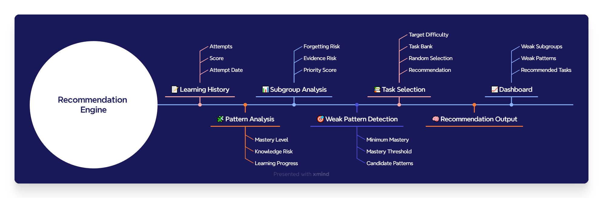

# Recommendation Engine

## 1. Введение

### Назначение документа

Данный документ описывает алгоритм формирования рекомендаций в проекте **Study Recommendation System**.

Recommendation Engine использует историю обучения пользователя для оценки уровня освоения материала, определения тем, требующих повторения, и автоматического формирования персональных рекомендаций по повторению.

В документе рассматриваются принципы работы алгоритма, используемые аналитические показатели, логика принятия решений и процесс подбора учебных задач.

### Связанные документы

Данный документ описывает только алгоритм формирования рекомендаций.

Связанные компоненты проекта рассматриваются в отдельных документах:

- `README.md` — обзор проекта и навигация по репозиторию.
- `System_Design.md` — архитектура системы и модель данных.
- `Database_Loading.md` — процесс загрузки данных в PostgreSQL.
- `Task_Bank.md` — структура и принципы формирования банка задач.
- `Dashboard.md` — аналитические представления и визуализация результатов.
- `Project_Roadmap.md` — направления дальнейшего развития проекта.

---

# 2. Назначение Recommendation Engine

Основная задача Recommendation Engine — превратить историю обучения в последовательность практических рекомендаций.

В отличие от обычных систем учёта решённых задач, Recommendation Engine не ограничивается хранением результатов обучения. Он анализирует накопленную статистику и отвечает на вопрос:

> **Какие темы следует доработать в первую очередь?**

Для этого алгоритм должен:

- оценить текущий уровень освоения материала;
- определить темы, требующие повторения;
- выявить наиболее слабые навыки;
- подобрать задачи подходящей сложности;
- сформировать персональные рекомендации по повторению.

Таким образом Recommendation Engine является связующим звеном между аналитикой и практикой. Он преобразует рассчитанные показатели в конкретные рекомендации для пользователя.

---

# 3. Общая логика работы

Работа Recommendation Engine состоит из нескольких последовательных этапов.

Каждый этап решает отдельную задачу и использует результаты предыдущего.

Такое разделение делает алгоритм модульным и позволяет изменять отдельные компоненты без пересмотра всей логики формирования рекомендаций.

В текущей версии Recommendation Engine использует подход, основанный на заранее определённых правилах и аналитических показателях. Это обеспечивает прозрачность алгоритма и позволяет объяснить пользователю причину каждой рекомендации.

### Рисунок 1. Архитектура Recommendation Engine 



---

# 4. Почему алгоритм разделён на этапы

При разработке Recommendation Engine рассматривался вариант, при котором рекомендации формировались бы одним большим SQL-запросом.

Однако такой подход имел несколько недостатков:

- логика становилась трудно читаемой;
- отдельные этапы было сложно тестировать;
- изменение одного правила влияло на весь алгоритм;
- было практически невозможно объяснить причину рекомендации.

Поэтому алгоритм был разделён на последовательные независимые этапы.

Каждый этап выполняет только одну функцию и передаёт результат следующему.

Это соответствует принципу **Separation of Concerns** и делает Recommendation Engine более гибким и понятным.

---

# 5. Двухуровневая модель рекомендаций

Одной из ключевых особенностей проекта является двухуровневая система формирования рекомендаций.

Во многих обучающих системах пользователю сразу предлагается список задач для решения.

Такой подход прост в реализации, но имеет существенный недостаток: пользователь видит отдельные упражнения, однако не понимает, какую тему они помогают закрепить.

В Study Recommendation System рекомендации формируются последовательно.

На первом этапе система определяет темы (подгруппы), требующие повторения.

На втором этапе внутри каждой выбранной темы определяются паттерны, требующие дополнительной практики, после чего подбираются конкретные задачи.

```text
Подгруппа
      ↓
Паттерны
      ↓
Задачи
```

Такой подход позволяет сначала ответить на вопрос **«Что необходимо повторить?»**, а затем — **«Как лучше это сделать?»**.

## Почему рекомендации строятся по подгруппам

Основной единицей принятия решений является подгруппа.

Она представляет собой отдельную учебную тему, объединяющую несколько взаимосвязанных паттернов.

Использование подгруппы позволяет сохранить баланс между детализацией и удобством восприятия.

Если рекомендации формировать только по паттернам, пользователь получает большое количество разрозненных советов.

Если использовать только крупные тематические группы, рекомендации становятся слишком общими.

Поэтому подгруппа была выбрана как оптимальный уровень для формирования учебного плана.

## Почему затем анализируются паттерны

После выбора темы система определяет, какие именно навыки внутри неё требуют повторения.

Это позволяет не предлагать повторение всей темы целиком, если проблема касается только отдельных паттернов.

В результате пользователь получает более точные рекомендации, а план обучения становится компактнее и практичнее.

---

# 6. Аналитические признаки (Learning Features)

После определения общей структуры Recommendation Engine переходит к анализу истории обучения.

На этом этапе рассчитываются аналитические показатели, которые используются при формировании рекомендаций.

Сама система ещё не принимает решений — её задача состоит в том, чтобы преобразовать накопленную историю обучения в набор количественных характеристик, описывающих текущее состояние каждой темы.

Все признаки рассчитываются в представлении `vw_learning_features` и используются как входные данные для последующих этапов Recommendation Engine.

Такое разделение позволяет отделить расчёт показателей от логики принятия решений и при необходимости изменять алгоритм рекомендаций без переработки аналитического слоя.

---

## Почему одного показателя недостаточно

Оценить уровень знаний только по среднему результату невозможно.

Например, высокий средний балл не означает, что тема хорошо усвоена: пользователь мог решить всего одну задачу или давно не возвращаться к материалу.

Аналогично, низкий результат не всегда свидетельствует о незнании темы — причиной может быть длительный перерыв в обучении.

Поэтому Recommendation Engine использует несколько независимых признаков, каждый из которых описывает отдельный аспект процесса обучения.

---

## Mastery Level

**Mastery Level** характеризует текущий уровень освоения темы.

В текущей версии проекта он рассчитывается как средний результат выполнения задач и выражается в процентах.

Этот показатель отражает, насколько успешно пользователь справлялся с заданиями по данной теме.

Mastery Level является базовой характеристикой уровня знаний и используется на всех последующих этапах Recommendation Engine.

---

## Knowledge Risk

**Knowledge Risk** показывает, насколько вероятно, что тема требует дополнительной проработки.

Чем ниже уровень освоения материала (**Mastery Level**), тем выше значение **Knowledge Risk**.

---

## Forgetting Risk

**Forgetting Risk** оценивает вероятность того, что ранее изученный материал был частично забыт.

В текущей версии проекта показатель определяется на основании количества дней, прошедших с последней попытки решения задач соответствующей темы.

Используется дискретная шкала, позволяющая постепенно увеличивать риск забывания по мере роста интервала без повторения.

Такой подход выбран сознательно: он прост, прозрачен и не требует большого объёма исторических данных.

---

## Evidence Risk

Даже высокий результат не всегда позволяет сделать надёжный вывод об уровне знаний.

Если пользователь решил всего одну или две задачи, Recommendation Engine располагает недостаточным количеством информации для объективной оценки.

Поэтому дополнительно рассчитывается **Evidence Risk**, характеризующий уровень доверия к накопленной статистике.

Чем меньше попыток решения, тем выше значение данного показателя.

Это позволяет системе осторожнее относиться к темам, по которым накоплено недостаточно данных.

---

## Роль аналитических признаков

Каждый показатель описывает только один аспект обучения.

Ни один из них не используется самостоятельно.

Только совместный анализ всех признаков позволяет объективно оценить текущее состояние знаний и перейти к следующему этапу — расчёту общего приоритета повторения.

---

# 7. Расчёт Priority Score

После расчёта аналитических признаков Recommendation Engine объединяет их в единый показатель — **Priority Score** — итоговый показатель приоритета повторения.

---

## Формула расчёта

В текущей версии проекта используется следующая формула:

```text
Priority Score =
    Knowledge Risk × 0.50 +
    Forgetting Risk × 0.30 +
    Evidence Risk × 0.20
```

Чем выше значение **Priority Score**, тем выше вероятность того, что тема должна быть включена в план обучения.

---

## Почему выбраны именно такие веса

Весовые коэффициенты отражают относительную важность различных факторов.

| Показатель | Вес |
|------------|----:|
| Knowledge Risk | 50% |
| Forgetting Risk | 30% |
| Evidence Risk | 20% |

Наибольший вклад в итоговую оценку вносит **Knowledge Risk**, поскольку недостаточное понимание материала является основной причиной необходимости повторения.

**Forgetting Risk** имеет меньший вес. Он позволяет учитывать влияние времени, но не должен полностью перекрывать уровень освоения темы.

**Evidence Risk** используется как корректирующий фактор. Он снижает уверенность Recommendation Engine в оценке тем, по которым накоплено недостаточно статистики.

Следует отметить, что данные коэффициенты являются экспертной оценкой и могут быть скорректированы по мере накопления истории обучения.

---

## Ограничения модели

Priority Score представляет собой первую версию модели оценки приоритета повторения.

Основным преимуществом выбранного подхода является его объяснимость — пользователь может понять, какие факторы повлияли на итоговую рекомендацию.

В дальнейшем возможны различные варианты развития алгоритма:

- изменение весовых коэффициентов на основе накопленной статистики;
- использование более сложных моделей забывания;
- применение методов машинного обучения для автоматического определения значимости факторов.

При этом сама архитектура Recommendation Engine не требует изменений — модифицируется только способ расчёта итогового приоритета.

---

# 8. Логика принятия решений (Decision Logic)

После расчёта **Priority Score** Recommendation Engine получает числовую оценку приоритета повторения для каждой подгруппы.

Однако одного числового значения недостаточно для формирования понятного плана обучения. Пользователю сложно интерпретировать разницу между, например, значениями **42** и **47**, а также определить, какие темы требуют немедленного внимания, а какие можно отложить.

Поэтому на следующем этапе **Priority Score** преобразуется в понятные категории рекомендаций.

---

## Абсолютный приоритет недостаточного освоения

Несмотря на использование интегральной оценки, в алгоритме существует одно правило, которое имеет более высокий приоритет.

Если **Mastery Level < 50%**, тема автоматически получает категорию **«Срочно повторить»**, независимо от значения **Priority Score**.

Такое решение отражает основную цель системы.

Если материал недостаточно освоен, его необходимо изучить прежде, чем учитывать влияние забывания или недостаточности данных. Даже высокий **Forgetting Risk** не должен иметь больший вес, чем отсутствие базового понимания темы.

Таким образом Recommendation Engine всегда отдаёт приоритет первоначальному освоению материала.

---

## Категории рекомендаций

Для всех остальных тем используется значение **Priority Score**.

В текущей версии проекта применяется четыре уровня рекомендаций.

| Priority Score | Категория |
|---------------:|-----------|
| ≥ 55 | 🔴 Срочно повторить |
| 35–54 | 🟠 Желательно повторить |
| 20–34 | 🟡 Можно повторить |
| < 20 | 🟢 Повторение пока не требуется |

Такое разделение позволяет быстро оценить текущее состояние обучения и определить очередность повторения тем.

---

## Почему используются категории

**Priority Score** хорошо подходит для ранжирования тем, однако плохо воспринимается пользователем как самостоятельный показатель.

Категории делают результаты значительно понятнее.

Вместо набора чисел пользователь получает готовый план действий, который можно сразу использовать при составлении программы повторения.

Кроме того, категории удобно использовать в Dashboard для группировки тем и визуализации общего состояния обучения.

---

## Определение причины рекомендации

Помимо уровня приоритета Recommendation Engine определяет основную причину включения темы в план повторения.

Причина выбирается по показателю, который внёс наибольший вклад в итоговую оценку.

В текущей версии используются три варианта:

- **Недостаточное освоение** — доминирует **Knowledge Risk**;
- **Давно не повторялась** — доминирует **Forgetting Risk**;
- **Недостаточно данных** — доминирует **Evidence Risk**.

Это делает рекомендации интерпретируемыми.

Пользователь понимает не только **что** необходимо повторить, но и **почему** система приняла именно такое решение.

---

## Выбор рекомендуемой сложности

После определения приоритета повторения Recommendation Engine рассчитывает рекомендуемый уровень сложности следующей задачи.

Используется простое правило.

| Mastery Level | Рекомендуемая сложность |
|--------------:|-----------------------:|
| < 50% | 1 |
| 50–74% | 2 |
| ≥ 75% | 3 |

Если тема освоена недостаточно хорошо, рекомендуется начать с задач базового уровня.

По мере роста уровня освоения система предлагает более сложные упражнения, позволяющие закрепить материал и избежать преждевременного перехода к сложным задачам.

---

## Результат этапа

После завершения данного этапа для каждой подгруппы определяются:

- Priority Score;
- категория рекомендации;
- причина рекомендации;
- рекомендуемая сложность следующей задачи.

На этом этапе Recommendation Engine ещё не выбирает конкретные упражнения.

Следующим шагом становится анализ паттернов внутри каждой выбранной подгруппы и подбор наиболее подходящих задач из банка.

---

# 9. Формирование рекомендаций

После определения подгрупп, требующих повторения, Recommendation Engine переходит к формированию персонального плана обучения.

Этот этап состоит из трёх последовательных шагов.

```text
Подгруппа
      ↓
Выбор паттернов
      ↓
Подбор задач
```

Таким образом система сначала определяет **что необходимо повторить**, а затем **каким способом это лучше сделать**.

---

## Выбор паттернов

Даже если подгруппа рекомендована к повторению, это не означает, что дополнительной практики требуют все входящие в неё паттерны.

Поэтому Recommendation Engine анализирует каждый паттерн отдельно.

Паттерн включается в план повторения, если выполняется хотя бы одно из условий:

- **Mastery Level < 50%**;
- уровень освоения находится в пределах заданного порога от самого слабого паттерна подгруппы.

Такой подход позволяет рекомендовать только те паттерны, которые действительно требуют дополнительной практики, не перегружая рекомендации уже хорошо освоенными темами.

---

## Почему используется относительный порог

После определения самого слабого паттерна система анализирует остальные паттерны этой же подгруппы.

Если уровень освоения другого паттерна отличается незначительно, Recommendation Engine также включает его в рекомендации.

Это позволяет не ограничиваться только одним минимальным значением.

Например, если самый слабый паттерн имеет уровень освоения **42%**, а следующий — **48%**, оба навыка требуют практически одинакового внимания и должны повторяться вместе.

Именно для этого используется параметр `mastery_threshold`, определяющий максимально допустимое отклонение от самого слабого паттерна.

В текущей версии проекта значение порога составляет **10%** и может изменяться без переработки алгоритма.

---

## Подбор задач

После формирования списка паттернов Recommendation Engine обращается к банку задач (`task_bank`).

Для каждого паттерна система определяет рекомендуемый уровень сложности и подбирает задачу, максимально соответствующую этому уровню.

Если задача нужной сложности отсутствует, выбирается ближайший доступный вариант.

Такой подход позволяет формировать рекомендации даже при неполном заполнении банка задач.

---

## Почему выбирается только одна задача

Для одного паттерна в банке может существовать несколько подходящих задач.

В текущей версии Recommendation Engine пользователю предлагается только одна задача.

Если несколько задач имеют одинаковую степень соответствия, выбор осуществляется случайным образом.

Это позволяет избежать постоянного повторения одного и того же упражнения и делает рекомендации более разнообразными.

В следующих версиях проекта алгоритм подбора может учитывать историю выполнения задач из банка, чтобы исключать уже недавно решённые упражнения.

---

## Результат работы Recommendation Engine

Результатом работы алгоритма является персональный план повторения.

Для каждой рекомендованной темы пользователь получает:

- приоритет повторения;
- причину рекомендации;
- список паттернов, требующих дополнительной практики;
- рекомендуемый уровень сложности;
- конкретную задачу для решения.

Таким образом Recommendation Engine преобразует историю обучения в последовательность конкретных действий, помогая пользователю сосредоточиться на наиболее важных темах.

---

# 10. Ограничения текущей версии и направления развития

Текущая версия Recommendation Engine реализует алгоритм с фиксированными правилами и ориентирована на прозрачность принимаемых решений.

Такой подход позволяет легко объяснить пользователю причину каждой рекомендации, однако имеет ряд ограничений.

В частности:

- Forgetting Risk рассчитывается по фиксированным временным интервалам;
- весовые коэффициенты задаются экспертным способом;
- параметры алгоритма заданы вручную и одинаково применяются ко всем темам;
- Recommendation Engine не учитывает историю выполнения задач из Task Bank.

По мере развития проекта планируется расширение алгоритма.

Основные направления развития:

- реализация интервального повторения (Spaced Repetition);
- персонализация Forgetting Risk;
- автоматическая настройка весовых коэффициентов;
- учёт истории решения задач из Task Bank;
- применение методов машинного обучения для прогнозирования вероятности забывания и персонализации рекомендаций.

Архитектура Recommendation Engine спроектирована таким образом, что перечисленные улучшения могут быть реализованы без изменения структуры базы данных.

В большинстве случаев потребуется изменить только алгоритм расчёта рекомендаций.
