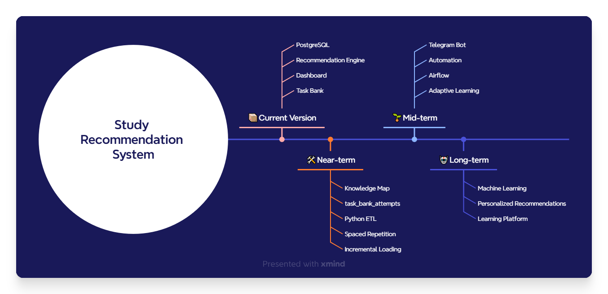

# Project Roadmap

## 1. Назначение документа

Данный документ описывает текущее состояние проекта **Study Recommendation System**, этапы его развития и основные направления дальнейшей эволюции.

Roadmap не является строгим планом разработки. Его задача — показать, как проект постепенно развивался, какие архитектурные решения уже реализованы и каким образом система будет расширяться в будущем.

### Связанные документы

Данный документ описывает текущее состояние проекта и направления его дальнейшего развития.

Подробная информация о других компонентах системы приведена в отдельных документах:

- `README.md` — обзор проекта и навигация по репозиторию.
- `System_Design.md` — архитектура системы и модель данных.
- `Recommendation_Engine.md` — алгоритм формирования рекомендаций.
- `Database_Loading.md` — процесс загрузки данных в PostgreSQL.
- `Task_Bank.md` — структура библиотеки задач.
- `Dashboard.md` — аналитические представления и визуализация результатов.

---

## 2. Эволюция проекта

Study Recommendation System не создавался как законченная система с самого начала.

Проект развивался постепенно по мере появления новых требований и накопления опыта. Каждый этап решал конкретную проблему предыдущей версии и становился основой для дальнейшего развития.

Последовательное развитие проекта позволило постепенно усложнять функциональность без изменения базовой архитектуры системы.

Каждый новый этап расширял возможности предыдущей версии и становился основой для дальнейшего развития проекта.

При этом проект развивался одновременно с накоплением собственной истории обучения.

Сначала система использовалась для хранения решённых задач и попыток их решения. Затем появились словарь паттернов (`dictionary`), аналитический слой, Recommendation Engine и Task Bank. Такой подход позволил постепенно развивать систему без пересмотра уже реализованной архитектуры.

Такой подход соответствует принципу итеративной разработки, при котором функциональность расширяется постепенно, сохраняя совместимость уже реализованных компонентов.

---

## 3. Текущее состояние проекта

На текущем этапе реализовано ядро системы.

В состав проекта входят:

- нормализованная база данных PostgreSQL;
- процесс загрузки данных через staging-слой;
- аналитические представления;
- Recommendation Engine первой версии;
- библиотека задач (Task Bank);
- интерактивный Dashboard.

Система уже позволяет анализировать историю обучения, определять темы, требующие повторения, и автоматически формировать персональные рекомендации по повторению материала.

Основные этапы развития проекта представлены в таблице ниже.

| Версия | Компонент | Статус |
|--------|-----------|:------:|
| v0.1 | Учёт задач в Google Sheets | ✅ |
| v0.2 | PostgreSQL Database | ✅ |
| v0.3 | Нормализованная модель данных | ✅ |
| v0.4 | История попыток решения | ✅ |
| v0.5 | ETL и staging-слой | ✅ |
| v0.6 | Task Bank | ✅ Beta |
| v0.7 | Analytics Layer | ✅ |
| v1.0 | Recommendation Engine | ✅ |
| v1.1 | Dashboard | ✅ |
| v1.2 | Расширение Task Bank | 🚧 |
| v1.3 | task_bank_attempts | 📋 |
| v1.4 | Python ETL | 📋 |
| v1.5 | Knowledge Map | 📋 |
| v1.6 | Spaced Repetition | 📋 |
| v1.7 | Telegram Bot | 📋 |
| v2.0 | ML Recommendation Engine | 💡 |

---

## 4. Развитие Recommendation Engine

Следующим этапом развития Recommendation Engine станет переход от фиксированных экспертных правил к более адаптивной модели рекомендаций.

Основные направления:

- использование истории выполнения задач из Task Bank;
- внедрение интервального повторения (Spaced Repetition);
- адаптация Forgetting Risk;
- подбор весовых коэффициентов;
- использование Knowledge Map для рекомендаций по новым темам;
- применение машинного обучения.

---

## 5. Развитие модели знаний

В текущей версии проекта словарь паттернов (`dictionary`) формируется постепенно по мере появления новых учебных задач.

Такой подход отражает естественный процесс накопления истории обучения, однако Recommendation Engine может анализировать только те темы, которые уже представлены в словаре.

Следующим этапом развития станет создание независимой Knowledge Map — полной карты знаний предметной области.

Knowledge Map позволит:

- анализировать полноту изучения дисциплины;
- выявлять темы, которые ещё отсутствуют в истории обучения;
- формировать рекомендации по изучению нового материала;
- использовать единую модель знаний для новых дисциплин.

---

## 6. Развитие Data Platform

В настоящее время загрузка данных выполняется с использованием SQL-скриптов и staging-таблиц.

В дальнейшем планируется автоматизировать процесс обработки данных.

Основные направления:

- автоматизация ETL с использованием Python;
- переход к инкрементальной загрузке данных;
- автоматический контроль качества данных;
- оркестрация процесса загрузки с использованием Apache Airflow.

---

## 7. Развитие Task Bank

На текущем этапе основное внимание уделяется развитию Task Bank и повышению качества содержащихся в нём задач.

Основные направления:

- полное покрытие паттернов учебными задачами;
- несколько уровней сложности для каждого паттерна;
- унификация структуры условий;
- расширение описаний типичных ошибок;
- накопление истории выполнения задач (`task_bank_attempts`).

---

## 8. Развитие Dashboard

Дальнейшее развитие Dashboard связано с расширением аналитических возможностей системы.

Планируется добавить:

- анализ динамики обучения;
- изменение Mastery Level во времени;
- визуализацию истории повторений;
- прогнозирование риска забывания;
- дополнительные фильтры и пользовательские настройки.

---

## 9. Автоматизация

После завершения основных компонентов проекта планируется автоматизировать взаимодействие с системой.

Основные направления:

- автоматические напоминания о повторении;
- регулярные отчёты о прогрессе;
- веб-интерфейс для работы с системой;
- Telegram-бот с персональными рекомендациями.

### Рисунок 1. Roadmap развития проекта 

Развитие проекта определяется не заранее установленным списком задач, а накоплением новых требований и появлением практических сценариев использования.

Поэтому Roadmap отражает текущее направление развития системы и может изменяться по мере появления новых идей, накопления данных и совершенствования алгоритмов Recommendation Engine.

---

## 10. Видение проекта

Долгосрочная цель Study Recommendation System заключается не только в создании рекомендательной системы для подготовки к техническим собеседованиям.

Проект постепенно развивается в универсальную платформу для анализа обучения, которая сможет сопровождать пользователя на всех этапах освоения новых дисциплин.

Архитектура системы изначально проектировалась как расширяемая и не зависит от конкретной предметной области. Благодаря этому в будущем платформа может поддерживать новые направления обучения без изменения структуры базы данных или логики Recommendation Engine.

Переход к Knowledge Map позволит отделить описание предметной области от накопленной истории обучения и сделать систему независимой от порядка появления новых учебных задач.

Такой подход позволяет постепенно развивать проект, сохраняя совместимость с уже накопленной историей обучения и обеспечивая устойчивую основу для дальнейшего внедрения адаптивных алгоритмов и методов машинного обучения.
